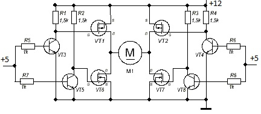
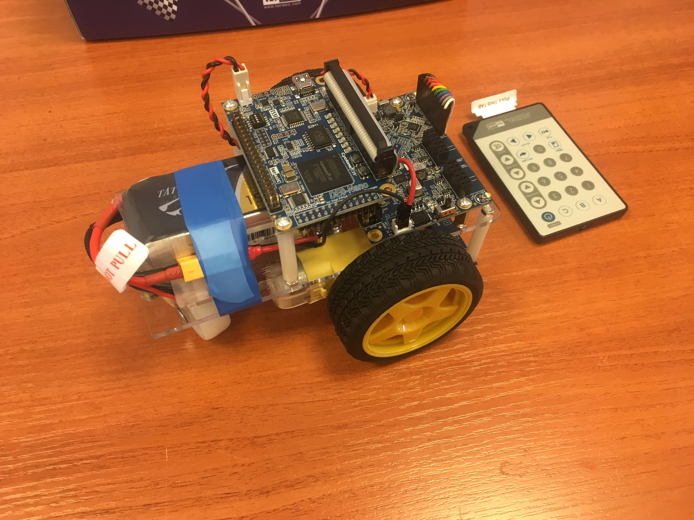

# A-Cute-Bluetooth
## Общее описание
Данный проект был создан в качестве примера реализации устройств с дистанционным управлением на основе плат с ПЛИС. В качестве управляемого устройства будет служить трехколосный робот из комплекта A-Cute Car компании Altera. Ниже будут рассмотрены основные теоритические сведенья, нужные для реализации и понимания программной части этого проекта, будет рассмотрен набор A-Cute Car и модуль Bluetooth HC-06, приведено краткое описание работы кода на языке описания аппаратуры Verilog, после чего приведена краткая инструкция запуска данного проекта.

## Теоретическое введение
### UART
**Универсальный асинхронный приёмопередатчик** (УАПП, англ. *Universal Asynchronous Receiver-Transmitter*, *UART*) — узел вычислительных устройств, предназначенный для организации связи с другими цифровыми устройствами. Преобразует передаваемые данные в последовательный вид так, чтобы было возможно передать их по одной физической цифровой линии другому аналогичному устройству. Метод преобразования хорошо стандартизован и широко применяется в компьютерной технике (особенно во встраиваемых устройствах и системах на кристалле (SoC)).

UART может представлять собой отдельную микросхему (например, Intel I8251, I8250) или являться частью большой интегральной схемы (например, микроконтроллера). Используется для передачи данных через последовательный порт компьютера, часто встраивается в микроконтроллеры.[[1](https://ru.wikipedia.org/wiki/Универсальный_асинхронный_приёмопередатчик)]

#### Метод передачи и приема

Передача данных в UART осуществляется по одному биту в равные промежутки времени. Последовательность битов определенной длины скрадывается в слово. Временной промежуток, который отвечает за длительность передачи одного бита определяется скоростью UART, которая может быть выбрана среди ряда стандартных скоростей (300; 600; 1200; 2400; 4800; 9600; 19200; 38400; 57600; 115200; 230400; 460800; 921600 бод) и для конкретного соединения устанавливается заранее.

Слово передачи UART помимо битов иформации включает биты начала и окончания передачи. Также возможно использования бита четности для проверки корректности передачи. После передачи служебные биты удаляются потока данных.

Принято соглашение, что при отсутствии информации для передачи состоянием входа и выхода UART является логическая 1. Передача начинается с по]вления стартового бита (логического 0), поэтому приёмник UART ожидает перехода из 1 в 0 и отсчитывает от него временной промежуток в половину длительности бита (середина передачи стартового бита). Если в этот момент на входе всё ещё 0, то запускается процесс приёма. Для этого приёмник отсчитывает 9 битовых длительностей подряд (для 8-битных данных) и в каждый момент фиксирует состояние входа. Первые 8 значений являются принятыми данными, последнее значение проверочное (стоп-бит). Значение стоп-бита всегда равно 1. Если реально принятое значение иное, фиксируется ошибка. Для отсчета требуемых временных интервалов требуется источник тактовых импульсов как на приемнике, так и на передатчике.

### Н-мост
**H-мост** — это электронная схема, которая даёт возможность приложить напряжение к нагрузке в разных направлениях. Эта схема очень часто используется в робототехнике и игрушечных машинах, чтобы изменять направление вращения мотора. H-мосты представлены в виде интегральных схем, а также могут быть построены из отдельных радиодеталей.

Структура H-моста (показано красным):

Термин H-мост появился благодаря графическому изображению этой схемы, напоминающему букву Н. H-мост собирается из 4 переключателей, электронных или механических (реле). Когда ключи S1 и S4 замкнуты, а S2 и S3 разомкнуты, мотор крутится в одну сторону, когда же S2 и S3 замкнуты, а S1 и S4 разомкнуты, мотор крутится в другую сторону. Также H-мост предоставляет возможность электрически тормозить вращение двигателя, коротко замыкая его выводы. [[2](https://ru.wikipedia.org/wiki/H-мост])].

#### Операции

Два базовых состояния H-моста:

Зачастую Н-мост используется для управлениями различными моторами, например моторами постоянного тока. Н-мост позволяет как менять полярность питания моторов для переключения напрвления вращения, так и для торможения.
Таблица ниже показывает, чего можно добиться, изменяя состояние ключей S1-S4 с первой схемы:

<table>
<tr><th>S1</th><th>S2</th><th>S3</th><th>S4</th><th>Результат</th></tr>
<tr><td>1</td><td>0</td><td>0</td><td>1</td><td>Мотор крутится вправо</td></tr>
<tr><td>0</td><td>1</td><td>1</td><td>0</td><td>Мотор крутится влево</th></tr>
<tr><td>0</td><td>0</td><td>0</td><td>0</td><td>Свободное вращение мотора</th></tr>
<tr><td>0</td><td>1</td><td>0</td><td>1</td><td>Мотор тормозится</th></tr>
<tr><td>1</td><td>0</td><td>1</td><td>0</td><td>Мотор тормозится</th></tr>
<tr><td>1</td><td>1</td><td>0</td><td>0</td><td>Короткое замыкание источника питания</th></tr>
<tr><td>0</td><td>0</td><td>1</td><td>1</td><td>Короткое замыкание источника питания</th></tr>
</table>

#### Конструкция
Для построения Н-моста возможно использовать транзисторы (биполярные или полевые) или реле.
Часто используются полевые транзисторы с изолированным затвором в связи с их способностью переключать большие токи, а также низким сопротивлением открытого канала, но в радиолюбительских и маломощных схемах часто присутствуют биполярные транзисторы [[2](https://ru.wikipedia.org/wiki/H-мост])].

### ШИМ
**Широтно-импульсная модуляция** (ШИМ, англ. *pulse-width modulation (PWM)*) — процесс управления мощности методом пульсирующёго включения и выключения прибора. Различаютают **аналоговую ШИМ** и **цифровую ШИМ**, **двоичную (двухуровневую) ШИМ** и **троичную (трёхуровневую) ШИМ** [[3](https://ru.wikipedia.org/wiki/Широтно-импульсная_модуляция)].

Рассмотрим подробнее цифровой двоичный ШИМ. Для получения некоторого желаемого среднего значения напряжения на выходах, которые могут принимать только 2 значения (высокий и низкий) возможно менять отношение времени высокого уровня к полной продолжительности цикла. Это отношение называется коэффициентом заполнения, а обратное отношение - скважностью. Для формирования такого сигнала используется генератор тактов, установив T как полное количество тактов в одном периоде ШИМ, меняя количество подряд идущих низких или высоких уровней внутри данного периода. Это требуется для управления с помощью цифрового сигнала устройствами, которые управляются аналоговыми сигналами (например таким образом можно регулировать яркость светодиодов или скорость работы электродвигателей)

## Аппаратная часть
### Набор A-Cute Car 
A-Cute Car – это робототехнический набор, основанный на ПЛИС [[4](https://www.terasic.com.tw/cgi-bin/page/archive.pl?Language=English&CategoryNo=238&No=1018&PartNo=1)]. Основу набора состовляет трехколесный робот для движения вдоль линии. В комплект набора так же входят: ИК-пульт для управления роботом, USB-A – Micro-USB кабель, 4 батарейки и блок питания на 5 В. 

Робот основан на плате Terasic DE0-Nano, приводится в движение двумя независимыми двигателями постоянного тока, имеет 7 датчиков освещенности, расположенных на отдельной плате, ИК-датчик для отслеживания комманд с пульта. Робот также оснащен платой управления питания, которая позволяет использовать в качестве питания не только батарейки, но и другие источники питания (например аккумуляторы или блоки питания) на 3,3 В - 12 В. Плата имеет 20 свободных GPIO выводов для подключения дополнительной переферии (а также 2 разъма расширения 2x6 TMD для тех же целей выведены на плату питания).

При активном использовании батарейки AA разряжаются очень быстро, а блок-питания не позволял в полной мере производить проверку работы дистанционного управления, поэтому отсек для батареек был заменен на аккуумулятор, контакрыты которого были подключены в рахъем на плате питания.

### Bluetooth модуль HC-06
В качестве приемника Bluetooth был использован модуль HC-06, который широко используется в среде самодельной электронике [[5](https://arduinomaster.ru/datchiki-arduino/arduino-bluetooth-hc05-hc06/)]. Для питания этого модуля возможно использовать, как 3,3В ,так и 5 В. Обмен информацией производяится через последовательный интерфейс UART, для него на модуле присутствуют два вывода TX и RX для приема и передачи. Уровнями логического ноля и еденицы выступают 0 В и 3,3 В соответственно. 

Для подключения модуля к плате DE0-Nano будем использовать свободные GPIO выводы.

Для питания используем вывод VCC3P3 (29) указанный на схеме, а для GND любой подходящий вывод GND (12 или 30). Для приема информации подключим вывод TX модуля Bluetooth к любому GPIO выводу (например 122). Вывод Rx подключать не обязательно, если не требуется передача данных с робота на другие устройства. Обозначение выбранного пина на плате можно посмотреть в документации производителя к DE0-Nano [[6](https://www.terasic.com.tw/cgi-bin/page/archive.pl?Language=English&CategoryNo=165&No=593&PartNo=4)], для вывода GPIO_122 используется PIN_R14.

## Программная часть
Для дистанционного управления роботом возможно использовать ИК-пульт. Для этого требуется использовать программное обеспечение, используемое платой робота по умолчанию. Также возможно использовать специальный Bluetooth модуль совместимый с набором A-Cute Car. Программное обеспечение для него располагается на сайте производителя [[4]](https://www.terasic.com.tw/cgi-bin/page/archive.pl?Language=English&CategoryNo=238&No=1018&PartNo=1). В случае использования стороннего модуля bluetooth (например HC-06) требуется написать свои модули на языке описания аппаратуры. Будем использовать язык Verilog HDL.
### Эмуляция UART интерфейса
Для приема информации с HC-06 требуется модуль эмулирующий работу интерфейса UART. Такие модули доступны в библиотеке IP компонентов, а также доступны в интернете. Будем использовать готовый код, доступный на странице [[7](https://www.electronoobs.com/eng_circuitos_tut26_code1.php)]. Рассмотрим работу модулей подробнее.
Для работы с UART используетются стандартные скорости передачи данных. Передатчик HC-06 использует по умолчанию скорость в 9600 бод/с. Для отсчета середины одного бита слова UART используется частота в 16 раз больше требуемой. Для получения тактового сигнала предназначен модуль UART_BaudRate_generator. Такотвый сигнал платы имеет частоту 50 МГц, а требуемая частота равняется 16 * 9600. Таким образом данный модуль представляет из себя делитель частоты на заданное число (в нашем случае на 325). 
Рассмотрим прием информации UART. Для этих целей используется модуль UART_rs232_rx. Он представляет из себя конечный автомат с 2мя состояниями: ожидание и чтение. В первом состоянии производится ожидание появления 0 на входе, при получении которого автомат переходит во второе состояние. Во втором состоянии происходит осчет 8 тактов сигнала, полученного в модуле UART_BaudRate_generator, после чего устанавливается флаг приема стартового бита. Далее производится считывание слова данных, длина которого указана в качестве аргумента модуля приема. Для HC-06 длина слова состоавляет 8 бит. По окончанию приема слова ожидается стоповый бит, а автомат переходит в состояние ожидания.
### Управление моторамии
Для управления моторами робота используется Н-мост, подключенный к GPIO выводам платы. Обозначения нужных пинов доступны в документации к набору. Комбинации управляющих сигналов подаваемые на входы Н-моста для движения и остановки моторов так же доступны в документации.

Для запуска и остановки моторов по сигналу Bluetooth будем отслеживать изменения в регистре принятой информации. При изменении будет изменяться содержимое регистров, ответственных за сигналы подаваемые на Н-мост. В качестве управляющих комбинаций используем коды чисел от 0 до 4 в таблице ASCII. Это позволит в дальнейшем использовать сторонние приложения для кправления моторами робота.
### Генерация ШИМ
Для управления скоростью вращения требуется генерация ШИМ сигнала, который будет подаваться заместо высокого уровня на входы Н-моста. Для генерации используется делитель частоты на велечену параметра, отвечающего за полную продолжительность цикла ШИМ. При этом счетчик сравнивается с параметром, отвечающим за коэффициент заполнения, если счетчик оказывается меньше или равен, то регистр ШИМ сигнала устанавливается в 1, иначе 0. Таким образом генерируется сигнал с требуемым коэффициентом заполнения. 
## Запуск
Для запуска модулей потребуется среда Quartus 16 c драйверами для платы DE0-Nano. Необходимо скачать файлы репозитория, нажав кнопку Clone or download. Создадим новый пустой проект, в котором на этапе выбора фацйлов добавим все Verilog файлы из репозитория.

После добавления файлов потребуется выбрать модель микросхемы. Плата робота использует микросхему Altera Cyclone® IV EP4CE22F17C6N FPGA, выберем ее в списке доступных.

После создания проекта необходимо назначить пины. Это можно сдлать используя инструмент Pin Planner или импортировав готовый файл, используя Assigments editor. Рассмотрим второй вариант. Добавим файл TOP.qsf, доступный в репозитории.
 

В полученной таблице можно изменить конкретные привязки в соответствии с выводами, к которым подключен модуль HC-06.
После назначения пинов можно произвести сборку проекта (Start compilation), по окончанию которой проект готов к прошивке платы (Programm Device). Для прошивки платы ее следует подключить к компьютеру и переключить ползунок на плате питания в активное положение.
Управление роботом возможно осуществлять через сторонне приложение для Andrion смартфона Serial Bluetooth Terminal [[8](https://play.google.com/store/apps/details?id=de.kai_morich.serial_bluetooth_terminal&hl=ru)]. В приложении требуется подключится к HC-06, выбрав его в списке доступных устройств.
 
 После подключения требуется в настройках передачи установить кодировку KOI8-R, а параметр **_new line_** установить в **_None_**.
 Для управления используются следующие команды:
 - 0 – движение вперед
 - 1 – остановка
 - 2 – движение назад
 - 3 – поворот вокруг совей оси в одну сторону
 - 4 – поворот вокруг своей оси в другую сторону
  
## Ссылки
1. https://ru.wikipedia.org/wiki/Универсальный_асинхронный_приёмопередатчик
2. https://ru.wikipedia.org/wiki/H-мост]
3. https://ru.wikipedia.org/wiki/Широтно-импульсная_модуляция
4. https://www.terasic.com.tw/cgi-bin/page/archive.pl?Language=English&CategoryNo=238&No=1018&PartNo=1
5. https://arduinomaster.ru/datchiki-arduino/arduino-bluetooth-hc05-hc06/
6. https://www.terasic.com.tw/cgi-bin/page/archive.pl?Language=English&CategoryNo=165&No=593&PartNo=4
7. https://www.electronoobs.com/eng_circuitos_tut26_code1.php
8. https://play.google.com/store/apps/details?id=de.kai_morich.serial_bluetooth_terminal&hl=ru