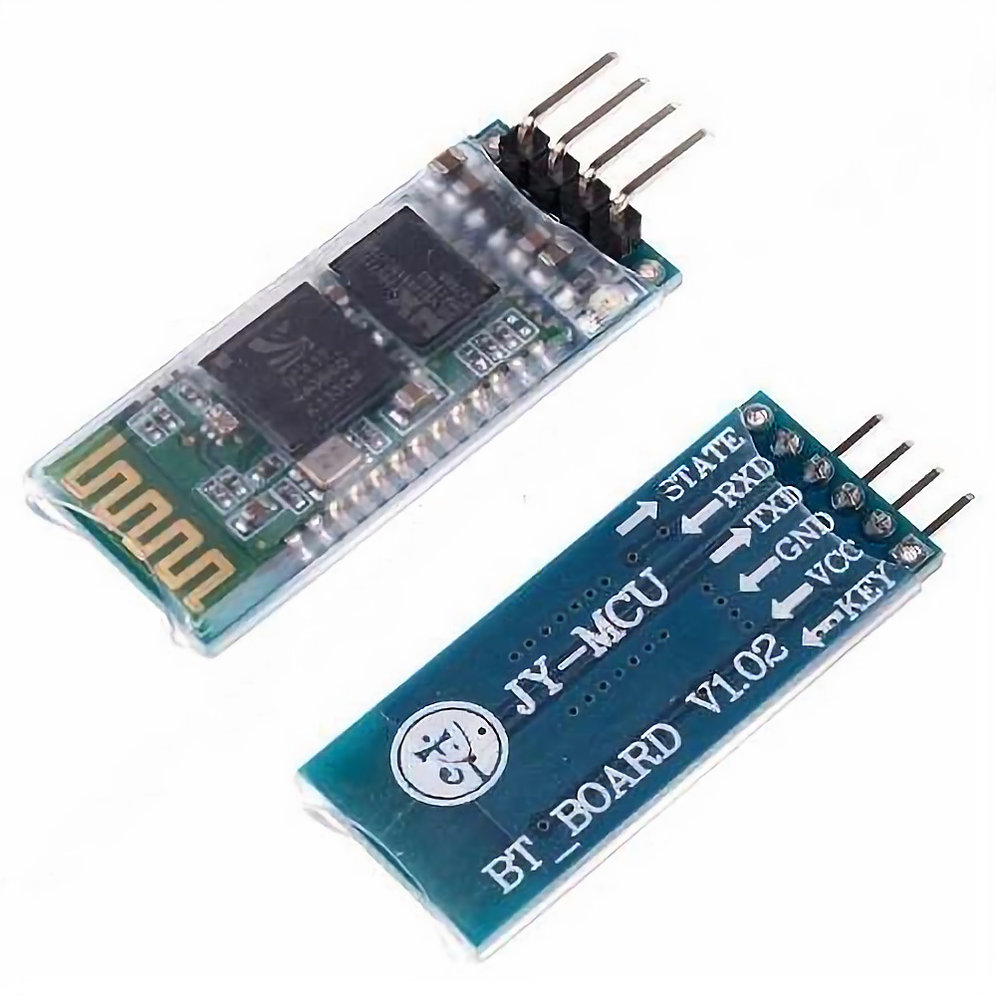
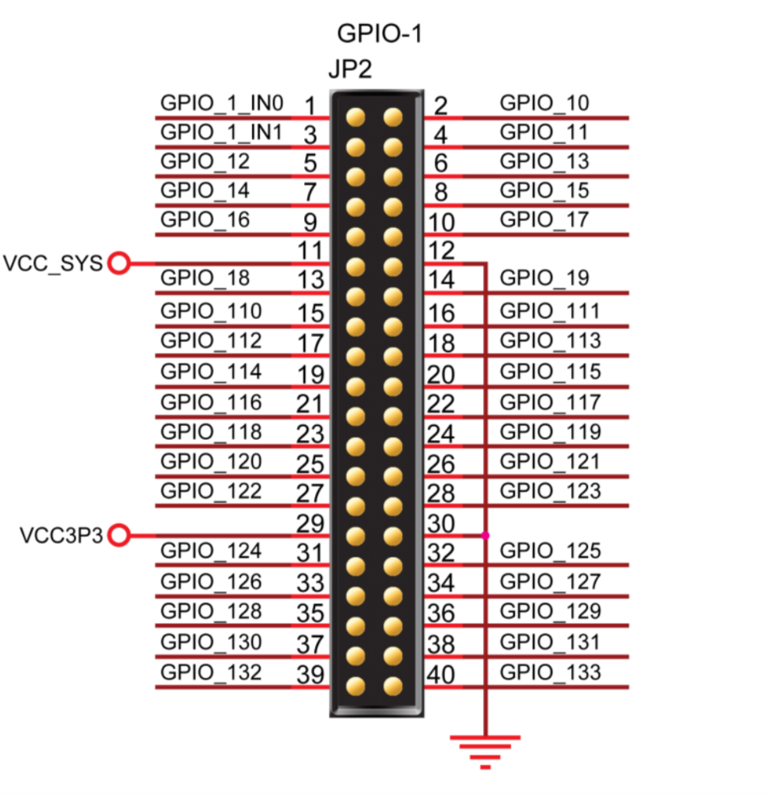
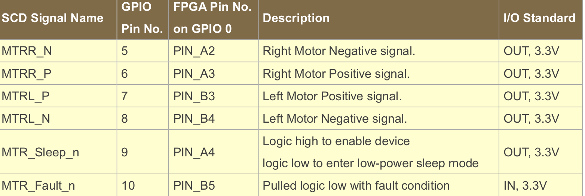
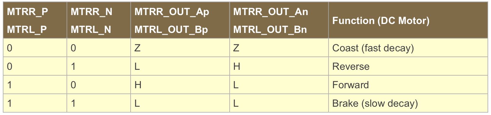
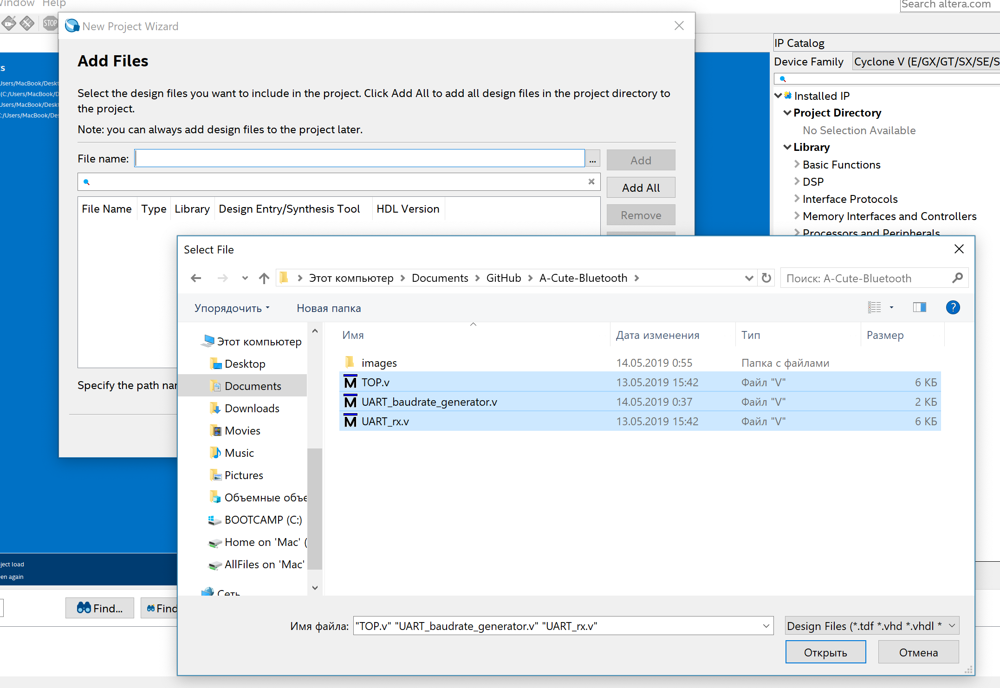
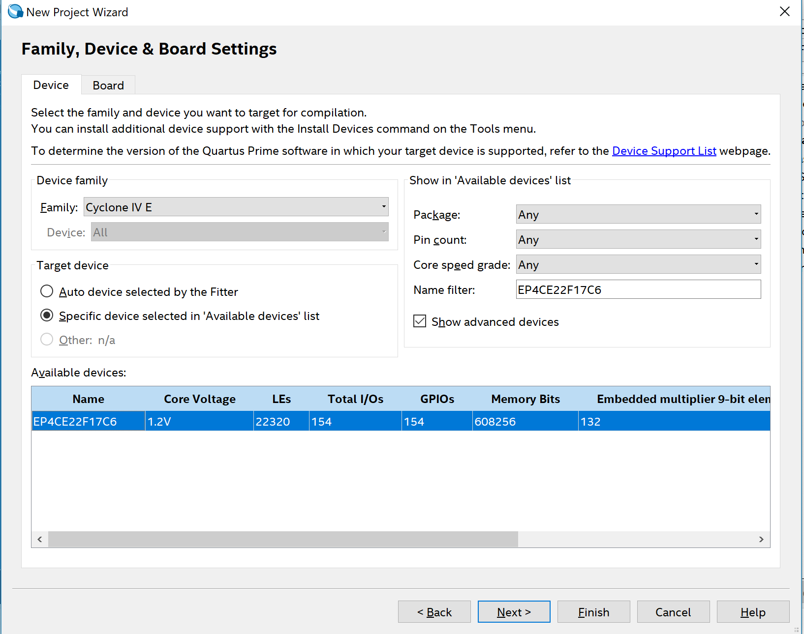
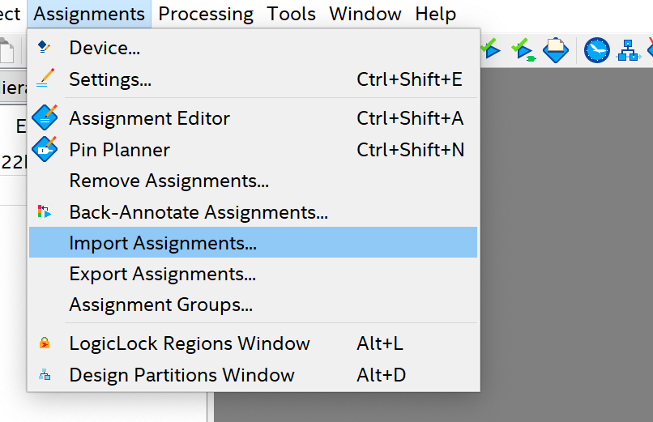
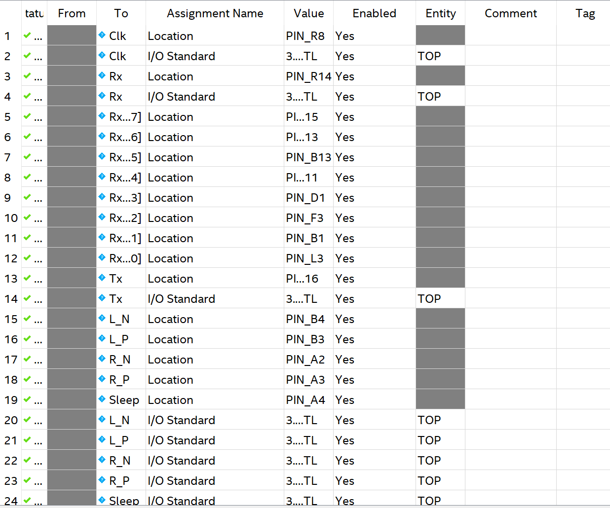
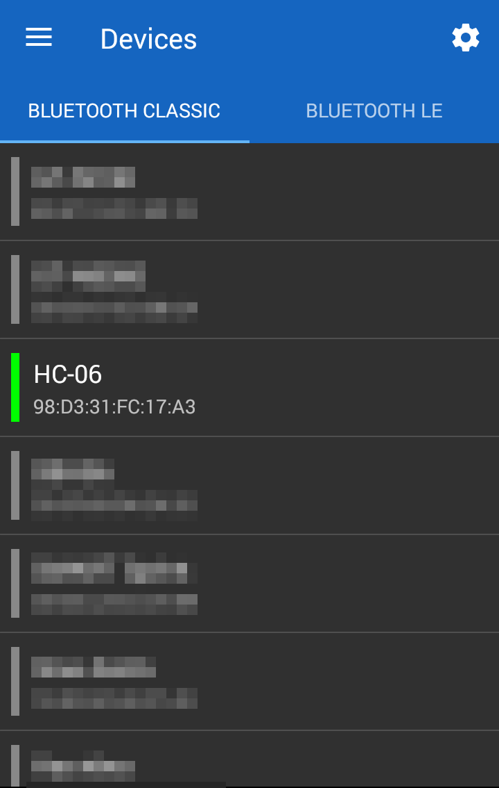
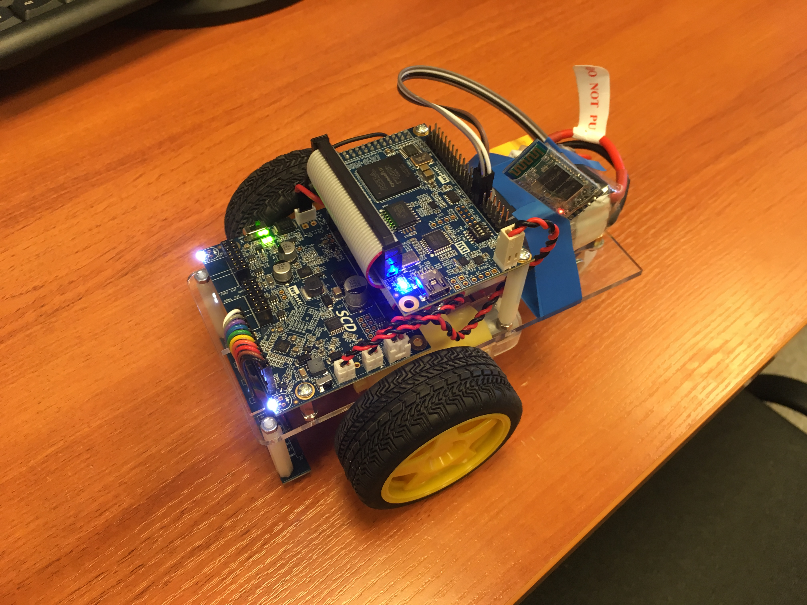

# A-Cute-Bluetooth
## Общее описание задачи
## Теоритическое введение
### UART
### Н-мост
### ШИМ
## Аппаратное часть
### Набор A-Cute Car 
A-Cute Car – это робототехнический набор, основанный на ПЛИС [[1]](https://www.terasic.com.tw/cgi-bin/page/archive.pl?Language=English&CategoryNo=238&No=1018&PartNo=1). Основу набора состовляет трехколесный робот для движения вдоль линии. В комплект набора так же входят: ИК-пульт для управления роботом, USB-A – Micro-USB кабель, 4 батарейки и блок питания на 5 В. 

Робот основан на плате Terasic DE0-Nano, приводится в движение двумя независимыми двигателями постоянного тока, имеет 7 датчиков освещенности, расположенных на отдельной плате, ИК-датчик для отслеживания комманд с пульта. Робот также оснащен платой управления питания, которая позволяет использовать в качестве питания не только батарейки, но и другие источники питания (например аккумуляторы или блоки питания) на 3,3 В - 12 В. Плата имеет 20 свободных GPIO выводов для подключения дополнительной переферии (а также 2 разъма расширения 2x6 TMD для тех же целей выведены на плату питания).

При активном использовании батарейки AA разряжаются очень быстро, а блок-питания не позволял в полной мере производить проверку работы дистанционного управления, поэтому отсек для батареек был заменен на аккуумулятор, контакрыты которого были подключены в рахъем на плате питания.

### Bluetooth модуль HC-06
В качестве приемника Bluetooth был использован модуль HC-06, который широко используется в среде самодельной электронике [[2](https://arduinomaster.ru/datchiki-arduino/arduino-bluetooth-hc05-hc06/)]. Для питания этого модуля возможно использовать, как 3,3В ,так и 5 В. Обмен информацией производяится через последовательный интерфейс UART, для него на модуле присутствуют два вывода TX и RX для приема и передачи. Уровнями логического ноля и еденицы выступают 0 В и 3,3 В соответственно. 

Для подключения модуля к плате DE0-Nano будем использовать свободные GPIO выводы.

Для питания используем вывод VCC3P3 (29) указанный на схеме, а для GND любой подходящий вывод GND (12 или 30). Для приема информации подключим вывод TX модуля Bluetooth к любому GPIO выводу (например 122). Вывод Rx подключать не обязательно, если не требуется передача данных с робота на другие устройства. Обозначение выбранного пина на плате можно посмотреть в документации производителя к DE0-Nano [[3](https://www.terasic.com.tw/cgi-bin/page/archive.pl?Language=English&CategoryNo=165&No=593&PartNo=4)], для вывода GPIO_122 используется PIN_R14.

## Программная часть
Для дистанционного управления роботом возможно использовать ИК-пульт. Для этого требуется использовать программное обеспечение, используемое платой робота по умолчанию. Также возможно использовать специальный Bluetooth модуль совместимый с набором A-Cute Car. Программное обеспечение для него располагается на сайте производителя [[1]](https://www.terasic.com.tw/cgi-bin/page/archive.pl?Language=English&CategoryNo=238&No=1018&PartNo=1). В случае использования стороннего модуля bluetooth (например HC-06) требуется написать свои модули на языке описания аппаратуры. Будем использовать язык Verilog HDL.
### Эмуляция UART интерфейса
Для приема информации с HC-06 требуется модуль эмулирующий работу интерфейса UART. Такие модули доступны в библиотеке IP компонентов, а также доступны в интернете. Будем использовать готовый код, доступный на странице [[4](https://www.electronoobs.com/eng_circuitos_tut26_code1.php)]. Рассмотрим работу модулей подробнее.
Для работы с UART используетются стандартные скорости передачи данных. Передатчик HC-06 использует по умолчанию скорость в 9600 бод/с. Для отсчета середины одного бита слова UART используется частота в 16 раз больше требуемой. Для получения тактового сигнала предназначен модуль UART_BaudRate_generator. Такотвый сигнал платы имеет частоту 50 МГц, а требуемая частота равняется 16 * 9600. Таким образом данный модуль представляет из себя делитель частоты на заданное число (в нашем случае на 325). 
Рассмотрим прием информации UART. Для этих целей используется модуль UART_rs232_rx. Он представляет из себя конечный автомат с 2мя состояниями: ожидание и чтение. В первом состоянии производится ожидание появления 0 на входе, при получении которого автомат переходит во второе состояние. Во втором состоянии происходит осчет 8 тактов сигнала, полученного в модуле UART_BaudRate_generator, после чего устанавливается флаг приема стартового бита. Далее производится считывание слова данных, длина которого указана в качестве аргумента модуля приема. Для HC-06 длина слова состоавляет 8 бит. По окончанию приема слова ожидается стоповый бит, а автомат переходит в состояние ожидания.
### Управление моторамии
Для управления моторами робота используется Н-мост, подключенный к GPIO выводам платы. Обозначения нужных пинов доступны в документации к набору. Комбинации управляющих сигналов подаваемые на входы Н-моста для движения и остановки моторов так же доступны в документации.

Для запуска и остановки моторов по сигналу Bluetooth будем отслеживать изменения в регистре принятой информации. При изменении будет изменяться содержимое регистров, ответственных за сигналы подаваемые на Н-мост. В качестве управляющих комбинаций используем коды чисел от 0 до 4 в таблице ASCII. Это позволит в дальнейшем использовать сторонние приложения для кправления моторами робота.
### Генерация ШИМ
Для управления скоростью вращения требуется генерация ШИМ сигнала, который будет подаваться заместо высокого уровня на входы Н-моста. Для генерации используется делитель частоты на велечену параметра, отвечающего за полную продолжительность цикла ШИМ. При этом счетчик сравнивается с параметром, отвечающим за коэффициент заполнения, если счетчик оказывается меньше или равен, то регистр ШИМ сигнала устанавливается в 1, иначе 0. Таким образом генерируется сигнал с требуемым коэффициентом заполнения. 
## Запуск
Для запуска модулей требуется среда Quartus 16 c драйверами для платы DE0-Nano. Создадим новый пустой проект, в котором на этапе выбора фацйлов добавим все Verilog файлы из репозитория.

После добавления файлов потребуется выбрать модель микросхемы. Плата робота использует микросхему Altera Cyclone® IV EP4CE22F17C6N FPGA, выберем ее в списке доступных.

После создания проекта необходимо назначить пины. Это можно сдлать используя инструмент Pin Planner или импортировав готовый файл, используя Assigments editor. Рассмотрим второй вариант. Добавим файл TOP.qsf, доступный в репозитории.
 

В полученной таблице можно изменить конкретные привязки в соответствии с выводами, к которым подключен модуль HC-06.
После назначения пинов можно произвести сборку проекта (Start compilation), по окончанию которой проект готов к прошивке платы (Programm Device). Для прошивки платы ее следует подключить к компьютеру и переключить ползунок на плате питания в активное положение.
Управление роботом возможно осуществлять через сторонне приложение для Andrion смартфона Serial Bluetooth Terminal [[5](https://play.google.com/store/apps/details?id=de.kai_morich.serial_bluetooth_terminal&hl=ru)]. В приложении требуется подключится к HC-06, выбрав его в списке доступных устройств.
 
 После подключения требуется в настройках передачи установить кодировку KOI8-R, а параметр **_new line_** установить в **_None_**.
 Для управления используются следующие команды:
 - 0 – движение вперед
 - 1 – остановка
 - 2 – движение назад
 - 3 – поворот вокруг совей оси в одну сторону
 - 4 – поворот вокруг своей оси в другую сторону
  
## Ссылки
