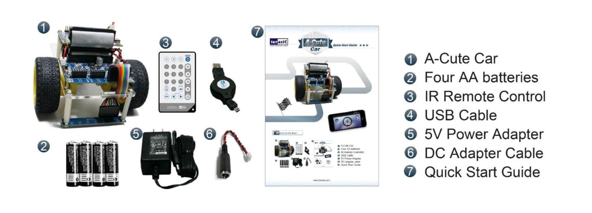
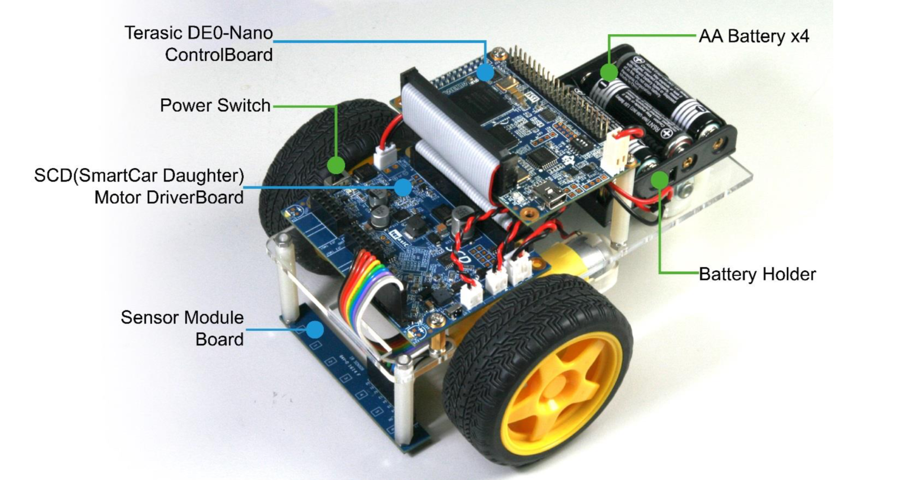
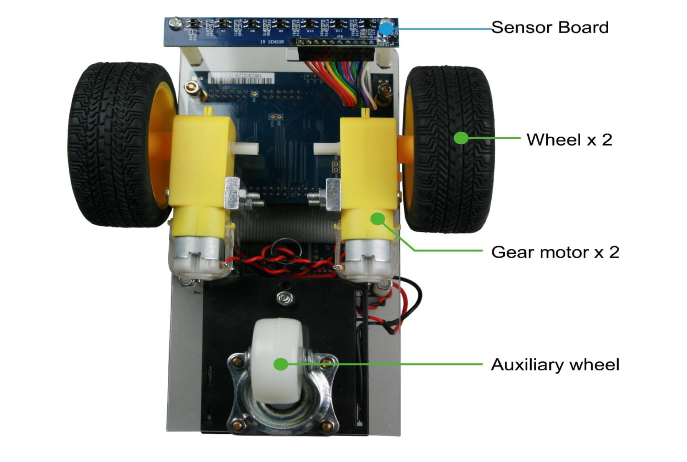

# A-Cute-Bluetooth
## Общее описание задачи
## Теоритическое введение
### UART
### Н-мост
### ШИМ
## Аппаратное часть
### Набор A-Cute Car 
A-Cute Car – это робототехнический набор, основанный на ПЛИС [[1]](https://www.terasic.com.tw/cgi-bin/page/archive.pl?Language=English&CategoryNo=238&No=1018&PartNo=1). Основу набора состовляет трехколесный робот для движения вдоль линии. В комплект набора так же входят: ИК-пульт для управления роботом, USB-A – Micro-USB кабель, 4 батарейки и блок питания на 5 В. 

Робот основан на плате Terasic DE0-Nano, приводится в движение двумя независимыми двигателями постоянного тока, имеет 7 датчиков освещенности, расположенных на отдельной плате, ИК-датчик для отслеживания комманд с пульта. Робот также оснащен платой управления питания, которая позволяет использовать в качестве питания не только батарейки, но и другие источники питания (например аккумуляторы или блоки питания) на 3,3 В - 12 В. Плата имеет 20 свободных GPIO выводов для подключения дополнительной переферии (а также 2 разъма расширения 2x6 TMD для тех же целей выведены на плату питания).

### Bluetooth модуль HC-06
### Подключение
## Программная часть
### UART модуль
### Управление моторамии
### Генерация ШИМ
## Запуск

