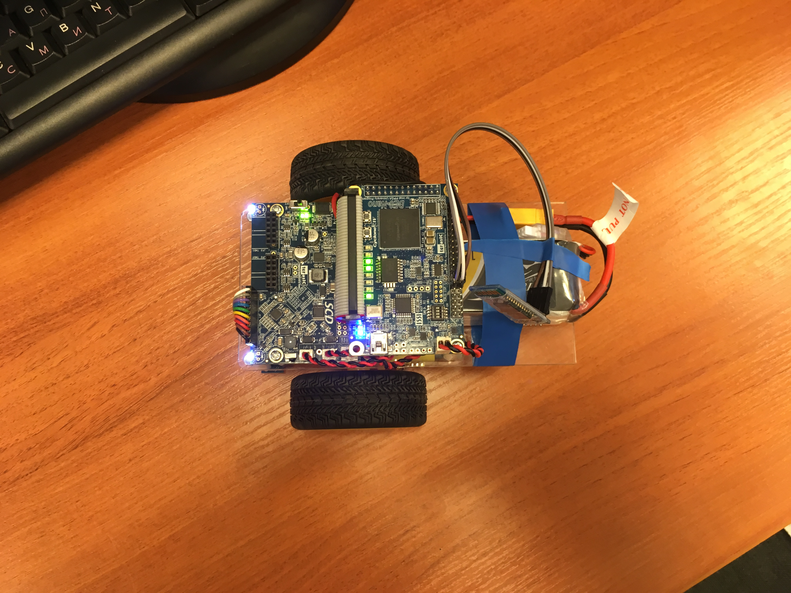

# A-Cute-Bluetooth
## Общее описание задачи
## Теоретическое введение
### UART
**Универсальный асинхронный приёмопередатчик** (УАПП, англ. *Universal Asynchronous Receiver-Transmitter*, *UART*) — узел вычислительных устройств, предназначенный для организации связи с другими цифровыми устройствами. Преобразует передаваемые данные в последовательный вид так, чтобы было возможно передать их по одной физической цифровой линии другому аналогичному устройству. Метод преобразования хорошо стандартизован и широко применяется в компьютерной технике (особенно во встраиваемых устройствах и системах на кристалле (SoC)).

Представляет собой логическую схему, с одной стороны подключённую к шине вычислительного устройства, а с другой имеющую два или более выводов для внешнего соединения.

UART может представлять собой отдельную микросхему (например, Intel I8251, I8250) или являться частью большой интегральной схемы (например, микроконтроллера). Используется для передачи данных через последовательный порт компьютера, часто встраивается в микроконтроллеры.

#### Метод передачи и приема

Передача данных в UART осуществляется по одному биту в равные промежутки времени. Этот временной промежуток определяется заданной скоростью UART и для конкретного соединения указывается в бодах (что в данном случае соответствует битам в секунду). Существует общепринятый ряд стандартных скоростей: 300; 600; 1200; 2400; 4800; 9600; 19200; 38400; 57600; 115200; 230400; 460800; 921600 бод. Скорость (*S*, бод) и длительность бита (*T*, секунд) связаны соотношением *T = 1 / S*. Скорость в бодах иногда называют сленговым словом бодрейт или битрейт.

Помимо информационных бит, UART автоматически вставляет в поток синхронизирующие метки, так называемые стартовый и стоповый биты. При приёме эти лишние биты удаляются из потока. Обычно стартовый и стоповый биты обрамляют один байт информации (8 бит), при этом младший информационный бит передаётся первым, сразу после стартового. Встречаются реализации UART, передающие по 5, 6, 7, или 9 информационных бит. Обрамленные стартом и стопом биты являются минимальной посылкой. Некоторые реализации UART используют два стоповых бита при передаче для уменьшения вероятности рассинхронизации приёмника и передатчика при плотном трафике. Приёмник игнорирует второй стоповый бит, воспринимая его как короткую паузу на линии.

Принято соглашение, что пассивным (в отсутствие потока данных) состоянием входа и выхода UART является логическая 1. Стартовый бит всегда логический 0, поэтому приёмник UART ждёт перепада из 1 в 0 и отсчитывает от него временной промежуток в половину длительности бита (середина передачи стартового бита). Если в этот момент на входе всё ещё 0, то запускается процесс приёма минимальной посылки. Для этого приёмник отсчитывает 9 битовых длительностей подряд (для 8-битных данных) и в каждый момент фиксирует состояние входа. Первые 8 значений являются принятыми данными, последнее значение проверочное (стоп-бит). Значение стоп-бита всегда равно 1. Если реально принятое значение иное, UART фиксирует ошибку.

Для формирования временных интервалов передающий и приёмный UART имеют источник точного времени (тактирования). Точность этого источника должна быть такой, чтобы сумма погрешностей (приёмника и передатчика) установки временного интервала от начала стартового импульса до середины стопового импульса не превышала половины (а лучше хотя бы четверти) битового интервала. Для 8-битной посылки это значение 0,5/9,5 ≈ 5 %. На практике, с учетом возможных искажений сигнала в линии, общая ошибка тактирования должна быть не более 3 %. Поскольку в худшем случае ошибки тактов приёмника и передатчика могут суммироваться то рекомендуемый допуск на точность тактирования UART   не более 1,5 %.

Поскольку синхронизирующие биты занимают часть битового потока, то результирующая пропускная способность UART меньше скорости соединения. Например, для 8-битных посылок формата 8-N-1 синхронизирующие биты занимают 20 % потока, что при физической скорости линии 115 200 бод означает полезную скорость передачи данных 92 160 бит/с или 11 520 байт/с.

##### Контроль чётности

Многие реализации UART имеют возможность автоматически контролировать целостность данных методом контроля битовой чётности. Когда эта функция включена, последний бит данных в минимальной посылке («бит чётности») контролируется логикой UART и содержит информацию о чётности количества единичных бит в этой минимальной посылке. Различают контроль на четность (англ. *Even parity* ), когда сумма количества единичных бит в посылке является четным числом, и контроль на нечетность (англ. Odd parity), когда эта сумма нечетна. При приеме такой посылки UART может автоматически контролировать бит четности и выставлять соответствующие признаки правильного или ошибочного приема.

<table>
<tr><th rowspan="2">Данные</th><th rowspan="2">Количество единичных бит</th><th colspan="2">Бит четности</th></tr>
<tr><th>even</th><th>odd</th></tr>
<tr><td>0000000</td><td align="center">0</td><td align="center">0</td><td align="center">1</td></tr>
<tr><td>1010001</td><td align="center">3</td><td align="center">1</td><td align="center">0</td></tr>
<tr><td>1101001</td><td align="center">4</td><td align="center">0</td><td align="center">1</td></tr>
<tr><td>1111111</td><td align="center">7</td><td align="center">1</td><td align="center">0</td></tr>
</table>

##### Короткая запись параметров

Был выработан и прижился короткий способ записи параметров UART, таких, как количество бит данных, наличие и тип бита четности, количество стоп-бит. Выглядит как запись вида цифра-буква-цифра, где:  
- Первая цифра обозначает количество бит данных, например, 8.
- Буква обозначает наличие и тип бита четности. Встречаются N (No parity) — без бита четности; E (Even parity) — с битом проверки на четность, O (Odd parity) — с битом проверки на нечетность;
- Последняя цифра обозначает длительность стоп-бита. Встречаются значения 1, 1.5 и 2 для длительности стоп-бита в 1, 1.5 и 2 битовых интервала соответственно.

Например, запись 8-N-1 обозначает, что UART настроен на 8 бит данных без бита четности и один стоповый бит. Для полноты параметров эту запись снабжают указанием скорости UART, например, 9600/8-N-1.

##### Break

Некоторые UART обладают возможностью посылать и принимать специальную посылку, называемую Break. Она состоит из непрерывного нулевого состояния линии длительностью заведомо больше минимальной посылки, обычно 1,5 минимальных посылки (для 8N1 это 15 битовых интервалов). Некоторые коммуникационные протоколы используют это свойство, например, протокол LIN использует Break для обозначения нового кадра.

##### Управление потоком

Ранние устройства с UART могли быть настолько медлительными, что не успевали обрабатывать поток принимаемых данных. Для решения этой проблемы модули UART иногда снабжались отдельными выходами и входами управления потоком. При заполнении входного буфера логика принимающего UART выставляла на соответствующем выходе запрещающий уровень, и передающий UART приостанавливал передачу.

Позже управление потоком возложили на коммуникационные протоколы (например, методом XOn/XOff), и надобность в отдельных линиях управления потоком постепенно исчезла.

#### Физический уровень

Логическая схема UART имеет входы-выходы с логическими уровнями, соответствующими полупроводниковой технологии схемы: КМОП, ТТЛ и т. д. Такой физический уровень может быть использован в пределах одного устройства, однако непригоден для коммутируемых длинных соединений по причине низкой защищённости от электрического разрушения и помех. Для таких случаев были разработаны специальные физические уровни, такие, как токовая петля, RS-232, RS-485, LIN и тому подобные.

Специфической разновидностью физического уровня асинхронного интерфейса является физический уровень IrDA.

Существуют физические уровни UART для сложных сред. В некотором смысле стандартный компьютерный телефонный модем также можно назвать специфическим физическим уровнем асинхронного интерфейса. Существуют специальные микросхемы проводных модемов, сделанных специально как физический уровень асинхронного интерфейса (то есть протокольно прозрачные). Выпускается также радиоканальный физический уровень в виде модулей радиоприёмников и радиопередатчиков.

##### Драйвер физического уровня

Для преобразования логических входов-выходов UART в сигналы соответствующего физического уровня применяют специальные электронные схемы, именуемые драйверами. Для всех популярных физуровней существуют интегральные драйверы в виде микросхем.

##### Дуплекс

Логика UART обычно позволяет производить одновременную передачу и прием. Эта способность часто обозначается сленговым словом дуплекс. Однако не все физические уровни позволяют одновременно передавать данные в обе стороны. В таких случаях принято говорить о полудуплексной связи. Существуют также решения, в которых передача данных физически возможна только в одну сторону, тогда говорят о симплексной связи.

##### Сеть

Изначально UART предназначался для связи двух устройств по принципу «точка-точка». Впоследствии были созданы физические уровни, которые позволяют связывать более двух UART по принципу «один говорит — несколько слушают». Такие физические уровни называют сетевыми. Существуют реализации типа общая шина (когда все приемопередатчики подключены к одному проводу) и кольцо (когда приемники и передатчики соединяют попарно в замкнутое кольцо). Первый вариант проще и встречается гораздо чаще. Второй вариант сложнее, но надежнее и быстрее: гарантируется работоспособность всех узлов (передающий узел услышит эхо своего сообщения, только если оно успешно ретранслировано всеми узлами); любой узел может начинать передачу в любой момент, не заботясь о риске коллизии. Наиболее известные сетевые физические уровни — RS-485 и LIN.
### Н-мост
**H-мост** — это электронная схема, которая даёт возможность приложить напряжение к нагрузке в разных направлениях. Эта схема очень часто используется в робототехнике и игрушечных машинах, чтобы изменять направление вращения мотора. H-мосты представлены в виде интегральных схем, а также могут быть построены из отдельных радиодеталей.

Структура H-моста (показано красным):

Термин H-мост появился благодаря графическому изображению этой схемы, напоминающему букву Н. H-мост собирается из 4 переключателей, электронных или механических (реле). Когда ключи S1 и S4 замкнуты, а S2 и S3 разомкнуты, мотор крутится в одну сторону, когда же S2 и S3 замкнуты, а S1 и S4 разомкнуты, мотор крутится в другую сторону. Также H-мост предоставляет возможность электрически тормозить вращение двигателя, коротко замыкая его выводы.

Также из схемы следует, что ключи S1 и S2, или S3 и S4 никогда не должны замыкаться вместе, так как это приведёт к короткому замыканию источника питания.

Использование в схеме в качестве переключателей тумблеров П2Т снимает проблему одновременного включения S1 и S2 (S3 и S4), т.к. П2Т (в зависимости от типа от П2Т-1 до П2Т-24) не допускают одновременного замыкания контактов на общий вывод.

#### Операции

Два базовых состояния H-моста:

Обычно H-мост используется для смены полярности питания мотора (реверс), но также он может и тормозить мотор, коротко замыкая его выводы (в случае простого мотора постоянного тока). Таблица ниже показывает, чего можно добиться, изменяя состояние ключей S1-S4:

<table>
<tr><th>S1</th><th>S2</th><th>S3</th><th>S4</th><th>Результат</th></tr>
<tr><td>1</td><td>0</td><td>0</td><td>1</td><td>Мотор крутится вправо</td></tr>
<tr><td>0</td><td>1</td><td>1</td><td>0</td><td>Мотор крутится влево</th></tr>
<tr><td>0</td><td>0</td><td>0</td><td>0</td><td>Свободное вращение мотора</th></tr>
<tr><td>0</td><td>1</td><td>0</td><td>1</td><td>Мотор тормозится</th></tr>
<tr><td>1</td><td>0</td><td>1</td><td>0</td><td>Мотор тормозится</th></tr>
<tr><td>1</td><td>1</td><td>0</td><td>0</td><td>Короткое замыкание источника питания</th></tr>
<tr><td>0</td><td>0</td><td>1</td><td>1</td><td>Короткое замыкание источника питания</th></tr>
</table>

#### Конструкция

Очень часто H-мосты строятся из приборов обратной полярности, таких как биполярные транзисторы типа р-n-р или полевых транзисторов с р-каналом, подключенных к биполярным транзисторам типа n-р-n или полевым с n-каналом.

Часто используются полевые транзисторы с изолированным затвором в связи с их способностью переключать большие токи, а также низким сопротивлением открытого канала, но в радиолюбительских и маломощных схемах часто присутствуют биполярные транзисторы.

H-мост также можно построить и с помощью механических переключателей, таких как реле, но с развитием электроники такой подход используется все реже.

### ШИМ
**Широтно-импульсная модуляция** (ШИМ, англ. *pulse-width modulation (PWM)*) — процесс управления мощности методом пульсирующёго включения и выключения прибора. Различаютают **аналоговую ШИМ** и **цифровую ШИМ**, **двоичную (двухуровневую) ШИМ** и **троичную (трёхуровневую) ШИМ**.

Основной причиной применения ШИМ является стремление к повышению КПД при построении вторичных источников питания электронной аппаратуры и в других узлах, например, ШИМ используется для регулировки яркости подсветки LCD-мониторов и дисплеев в телефонах, КПК и т.п.

График, иллюстрирующий применение трёхуровневой ШИМ для управления электродвигателем, которая используется в приводах асинхронных электродвигателей с переменной частотой. Напряжение от ШИ-модулятора, подаваемое на обмотку машины изображено синим (V). Магнитный поток в статоре машины показан красным (B). Здесь магнитный поток имеет приблизительно синусоидальную форму, благодаря соответствующему закону ШИМ.

#### Тепловая мощность, выделяемая на ключе при ШИМ

В ШИМ в качестве ключевых элементов использует транзисторы (могут быть применены и др. полупроводниковые приборы) не в линейном, а в ключевом режиме, то есть транзистор всё время или разомкнут (выключен), или замкнут (находится в состоянии насыщения). В первом случае транзистор имеет почти бесконечное сопротивление, поэтому ток в цепи весьма мал, и, хотя всё напряжение питания падает на транзисторе, выделяемая на транзисторе мощность практически равна нулю. Во втором случае сопротивление транзистора крайне мало, и, следовательно, падение напряжения на нём близко к нулю — выделяемая мощность также мала. В переходных состояниях (переход ключа из проводящего состояния в непроводящее и обратно) мощность, выделяемая в ключе, значительна, но так как длительность переходных состояний крайне мала, по отношению к периоду модуляции, то средняя мощность потерь на переключение оказывается незначительной.

#### Принцип работы ШИМ

##### Аналоговая ШИМ

Один из методов двухуровневой ШИМ с помощью аналогового компаратора. На один из входов компаратора подаётся пилообразное напряжение от вспомогательного генератора, на другой вход — модулирующее напряжение. Состояние выхода компаратора — ШИ-модуляция. На рис.: сверху — пилообразный сигнал и модулирующее напряжение, снизу — результат ШИМ.

ШИМ-сигнал генерируется аналоговым компаратором, на один вход (по рисунку — на инвертирующий вход компаратора) которого подаётся вспомогательный опорный пилообразный или треугольный сигнал, значительно большей частоты, чем частота модулирующего сигнала, а на другой — модулирующий непрерывный аналоговый сигнал. Частота повторения выходных импульсов ШИМ равна частоте пилообразного или треугольного напряжения. В ту часть периода пилообразного напряжения, когда сигнал на инвертирующем входе компаратора выше сигнала на неинвертирующем входе, куда подается модулирующий сигнал, на выходе получается отрицательное напряжение, в другой части периода, когда сигнал на инвертирующем входе компаратора ниже сигнала на неинвертирующем входе — будет положительное напряжение.

Аналоговая ШИМ реализуется с помощью компаратора, на один вход которого подаются треугольный или пилообразный периодический сигнал со вспомогательного генератора, а на другой — модулирующий сигнал. На выходе компаратора образуются периодические прямоугольные импульсы с переменной шириной, скважность которых изменяется по закону модулирующего сигнала, а частота равна частоте треугольного или пилообразного сигнала и обычно постоянна.

Аналоговая ШИМ применяется в усилителях низкой частоты класса «D».

##### Цифровая ШИМ

В двоичной цифровой технике, выходы в которой могут принимать только одно из двух значений, приближение желаемого среднего уровня выхода при помощи ШИМ является совершенно естественным. Схема настолько же проста: пилообразный сигнал генерируется N-битным счётчиком. Цифровые устройства (ЦШИП) работают на фиксированной частоте, обычно намного превышающей реакцию управляемых установок (передискретизация). В периоды между фронтами тактовых импульсов выход ЦШИП остаётся стабильным, на нём действует либо низкий уровень, либо высокий, в зависимости от выхода цифрового компаратора, сравнивающего значение счётчика с уровнем приближаемого цифрового сигнала *V(n)*. Выход за много тактов можно трактовать как череду импульсов с двумя возможными значениями 0 и 1, сменяющими друг друга каждый такт T. Частота появления единичных импульсов получается пропорциональной уровню приближаемого сигнала *~V(n)*. Единицы, следующие одна за другой, формируют контур одного, более широкого импульса. Длительности полученных импульсов переменной ширины *~V(n)* кратны периоду тактирования T, а частота равна *1/(T\*2^N)*. Низкая частота означает длительные, относительно T, периоды постоянства сигнала одного уровня, что даёт невысокую равномерность распределения импульсов.

В цифровой ШИМ период делится на части, которые заполняются прямоугольными подымпульсами. Средняя величина за период зависит от количества прямоугольных подымпульсов. Цифровая ШИМ — приближение бинарного сигнала (с двумя уровнями — *вкл/выкл*) к многоуровневому или непрерывному сигналу так, чтобы их средние значения за период времени *t2 − t1* были бы приблизительно равны.

Управляемыми «уровнями», как правило, являются параметры питания силовой установки, например, напряжение импульсных преобразователей /регуляторов постоянного напряжения/ или скорость электродвигателя. Для импульсных источников *x(t) = Uconst* стабилизации.

В цифровой ШИМ прямоугольные подымпульсы, заполняющие период, могут стоять в любом месте периода, на среднюю величину за период влияет только их количество. Например, при разбиении периода на 8 частей последовательности `11110000`, `11101000`, `11100100`, `11100010`, `11100001` и др. дают одинаковую среднюю за период величину, но отдельно стоящие «1» ухудшают режим работы ключа (транзистора).

В качестве ШИМ можно использовать даже COM-порт. Так как 0 передаётся как `0 0000 0000 1` (8 бит данных + старт/стоп), а 255 как `0 1111 1111 1`, то диапазон выходных напряжений — 10-90 % с шагом в 10 %.

## Аппаратная часть
### Набор A-Cute Car 
A-Cute Car – это робототехнический набор, основанный на ПЛИС [[1]](https://www.terasic.com.tw/cgi-bin/page/archive.pl?Language=English&CategoryNo=238&No=1018&PartNo=1). Основу набора состовляет трехколесный робот для движения вдоль линии. В комплект набора так же входят: ИК-пульт для управления роботом, USB-A – Micro-USB кабель, 4 батарейки и блок питания на 5 В. 

Робот основан на плате Terasic DE0-Nano, приводится в движение двумя независимыми двигателями постоянного тока, имеет 7 датчиков освещенности, расположенных на отдельной плате, ИК-датчик для отслеживания комманд с пульта. Робот также оснащен платой управления питания, которая позволяет использовать в качестве питания не только батарейки, но и другие источники питания (например аккумуляторы или блоки питания) на 3,3 В - 12 В. Плата имеет 20 свободных GPIO выводов для подключения дополнительной переферии (а также 2 разъма расширения 2x6 TMD для тех же целей выведены на плату питания).

При активном использовании батарейки AA разряжаются очень быстро, а блок-питания не позволял в полной мере производить проверку работы дистанционного управления, поэтому отсек для батареек был заменен на аккуумулятор, контакрыты которого были подключены в рахъем на плате питания.

### Bluetooth модуль HC-06
В качестве приемника Bluetooth был использован модуль HC-06, который широко используется в среде самодельной электронике [[2](https://arduinomaster.ru/datchiki-arduino/arduino-bluetooth-hc05-hc06/)]. Для питания этого модуля возможно использовать, как 3,3В ,так и 5 В. Обмен информацией производяится через последовательный интерфейс UART, для него на модуле присутствуют два вывода TX и RX для приема и передачи. Уровнями логического ноля и еденицы выступают 0 В и 3,3 В соответственно. 

Для подключения модуля к плате DE0-Nano будем использовать свободные GPIO выводы.

Для питания используем вывод VCC3P3 (29) указанный на схеме, а для GND любой подходящий вывод GND (12 или 30). Для приема информации подключим вывод TX модуля Bluetooth к любому GPIO выводу (например 122). Вывод Rx подключать не обязательно, если не требуется передача данных с робота на другие устройства. Обозначение выбранного пина на плате можно посмотреть в документации производителя к DE0-Nano [[3](https://www.terasic.com.tw/cgi-bin/page/archive.pl?Language=English&CategoryNo=165&No=593&PartNo=4)], для вывода GPIO_122 используется PIN_R14.

## Программная часть
Для дистанционного управления роботом возможно использовать ИК-пульт. Для этого требуется использовать программное обеспечение, используемое платой робота по умолчанию. Также возможно использовать специальный Bluetooth модуль совместимый с набором A-Cute Car. Программное обеспечение для него располагается на сайте производителя [[1]](https://www.terasic.com.tw/cgi-bin/page/archive.pl?Language=English&CategoryNo=238&No=1018&PartNo=1). В случае использования стороннего модуля bluetooth (например HC-06) требуется написать свои модули на языке описания аппаратуры. Будем использовать язык Verilog HDL.
### Эмуляция UART интерфейса
Для приема информации с HC-06 требуется модуль эмулирующий работу интерфейса UART. Такие модули доступны в библиотеке IP компонентов, а также доступны в интернете. Будем использовать готовый код, доступный на странице [[4](https://www.electronoobs.com/eng_circuitos_tut26_code1.php)]. Рассмотрим работу модулей подробнее.
Для работы с UART используетются стандартные скорости передачи данных. Передатчик HC-06 использует по умолчанию скорость в 9600 бод/с. Для отсчета середины одного бита слова UART используется частота в 16 раз больше требуемой. Для получения тактового сигнала предназначен модуль UART_BaudRate_generator. Такотвый сигнал платы имеет частоту 50 МГц, а требуемая частота равняется 16 * 9600. Таким образом данный модуль представляет из себя делитель частоты на заданное число (в нашем случае на 325). 
Рассмотрим прием информации UART. Для этих целей используется модуль UART_rs232_rx. Он представляет из себя конечный автомат с 2мя состояниями: ожидание и чтение. В первом состоянии производится ожидание появления 0 на входе, при получении которого автомат переходит во второе состояние. Во втором состоянии происходит осчет 8 тактов сигнала, полученного в модуле UART_BaudRate_generator, после чего устанавливается флаг приема стартового бита. Далее производится считывание слова данных, длина которого указана в качестве аргумента модуля приема. Для HC-06 длина слова состоавляет 8 бит. По окончанию приема слова ожидается стоповый бит, а автомат переходит в состояние ожидания.
### Управление моторамии
Для управления моторами робота используется Н-мост, подключенный к GPIO выводам платы. Обозначения нужных пинов доступны в документации к набору. Комбинации управляющих сигналов подаваемые на входы Н-моста для движения и остановки моторов так же доступны в документации.

Для запуска и остановки моторов по сигналу Bluetooth будем отслеживать изменения в регистре принятой информации. При изменении будет изменяться содержимое регистров, ответственных за сигналы подаваемые на Н-мост. В качестве управляющих комбинаций используем коды чисел от 0 до 4 в таблице ASCII. Это позволит в дальнейшем использовать сторонние приложения для кправления моторами робота.
### Генерация ШИМ
Для управления скоростью вращения требуется генерация ШИМ сигнала, который будет подаваться заместо высокого уровня на входы Н-моста. Для генерации используется делитель частоты на велечену параметра, отвечающего за полную продолжительность цикла ШИМ. При этом счетчик сравнивается с параметром, отвечающим за коэффициент заполнения, если счетчик оказывается меньше или равен, то регистр ШИМ сигнала устанавливается в 1, иначе 0. Таким образом генерируется сигнал с требуемым коэффициентом заполнения. 
## Запуск
Для запуска модулей требуется среда Quartus 16 c драйверами для платы DE0-Nano. Создадим новый пустой проект, в котором на этапе выбора фацйлов добавим все Verilog файлы из репозитория.

После добавления файлов потребуется выбрать модель микросхемы. Плата робота использует микросхему Altera Cyclone® IV EP4CE22F17C6N FPGA, выберем ее в списке доступных.

После создания проекта необходимо назначить пины. Это можно сдлать используя инструмент Pin Planner или импортировав готовый файл, используя Assigments editor. Рассмотрим второй вариант. Добавим файл TOP.qsf, доступный в репозитории.
 

В полученной таблице можно изменить конкретные привязки в соответствии с выводами, к которым подключен модуль HC-06.
После назначения пинов можно произвести сборку проекта (Start compilation), по окончанию которой проект готов к прошивке платы (Programm Device). Для прошивки платы ее следует подключить к компьютеру и переключить ползунок на плате питания в активное положение.
Управление роботом возможно осуществлять через сторонне приложение для Andrion смартфона Serial Bluetooth Terminal [[5](https://play.google.com/store/apps/details?id=de.kai_morich.serial_bluetooth_terminal&hl=ru)]. В приложении требуется подключится к HC-06, выбрав его в списке доступных устройств.
 
 После подключения требуется в настройках передачи установить кодировку KOI8-R, а параметр **_new line_** установить в **_None_**.
 Для управления используются следующие команды:
 - 0 – движение вперед
 - 1 – остановка
 - 2 – движение назад
 - 3 – поворот вокруг совей оси в одну сторону
 - 4 – поворот вокруг своей оси в другую сторону
  
## Ссылки
